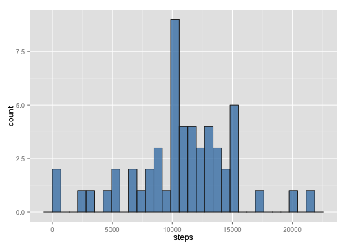
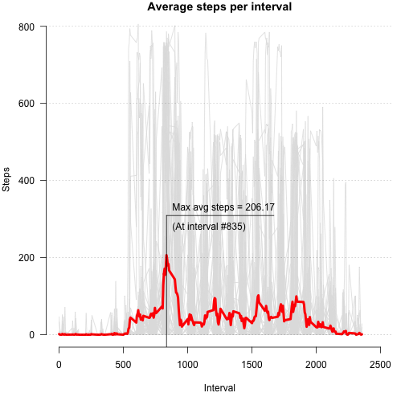
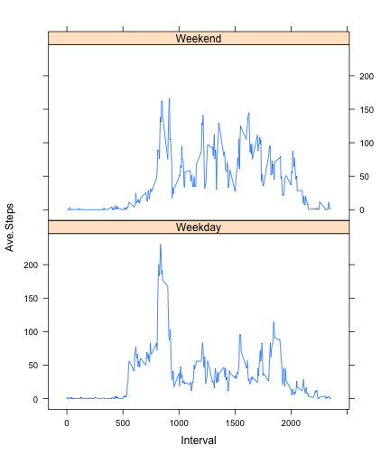

## Introduction
This is the report for the Peer Assessment 1 activity of the *Reproducible Research* course on Coursera. In this document I'll present the analysis of the activity monitoring data provided by the course instructors.

## Loading and preprocessing the data
The relevant data is available in the _activity.csv_ file, so let's load it now:

```r
data<-read.table("activity.csv", header=T, sep=",")

# Transform dates into Date objects
data<-transform(data,date=as.Date(date))

# Get number of steps per day and store it in a different variable
steps.byday<-with(data,tapply(steps,date,sum))
data.byday<-data.frame(day=as.Date(names(steps.byday)),
                       steps=as.numeric(steps.byday))
```

Notice that I transformed the _date_ column into a **Date** object, which may help afterwards. Also notice that any day with missing data will result in an **NA** in the _steps.byday_ variable: this was done intentionally, so as to prevent any eventual bias due to 'missingness'.

## What is mean total number of steps taken per day?
To have an idea about the distribution of the number of daily steps, let's first examine the histogram for the _steps_ column. Notice that I'll discard the **NA**s for now:

```r
library(ggplot2)

# plot histogram
m<-ggplot(data.byday,aes(steps),na.rm=T)
m + geom_histogram(color="#222222",
                   fill="steelblue",
                   alpha=0.8)
```



```r
# Calculate mean...
mean(data.byday$steps,na.rm=T)
```

```
## [1] 10766.19
```

```r
#...  and median daily steps
median(data.byday$steps,na.rm=T)
```

```
## [1] 10765
```


## What is the average daily activity pattern?
Let's now examine the activity pattern of the individual over the day. First, let's calculate some useful quantities:


```r
# Average number of steps per day:
ave.steps<-with(data,tapply(steps,interval,mean,na.rm=T));

# maximum average steps and time interval when it occurs:
max.ave.steps<-max(ave.steps)
max.int<-with(data,interval[which(ave.steps==max.ave.steps)])
```

Now let's plot something nice:

```r
par(mar=c(5,4,1,1),las=1,bty="n")
with(data,{
    # Prepare empty plot:
    plot(interval,steps,type="n",
         xlab="Interval",
         ylab="Steps",
         main="Average steps per interval",
         xlim=c(0,2500));
    
    # Insert activity lines for each day (light gray)
    for(i in 1:length(unique(date))){
        lines(interval[date==unique(date)[i]],
              steps[date==unique(date)[i]],
              col="#e0e0e0",lty=1,lwd=1)
        };
    
    # Insert average line (red, thicker)
    lines(unique(interval),
          ave.steps,
          lty=1,lwd=4,col=2);
    
    # Decorate the plot with information about the maximum average steps
    lines(rep(max.int,2),c(-75,1.5*max.ave.steps));
    lines(c(max.int,2*max.int),rep(1.5*max.ave.steps,2));
    text(x=rep(max.int,2),
         y=max.ave.steps*c(1.6,1.35),
         pos=4,
         labels=c(paste("Max avg steps = ",signif(max.ave.steps,5),sep=""),
                  paste("(At interval #",max.int,")",sep="")));
    grid(NA, NULL, col="black", lty="dotted", lwd=0.4)
    })
```



I got the idea of ploting each day in light gray and highlighting the mean line from Nathan Yau's excellent book [**Visualize This!**] [1] and his tutorial [**Moving Past Default Charts**] [2]. I also used the plot to inform the reader about the maximum average number of steps, and the time interval at which it occurs.

[1]: http://flowingdata.com/visualize-this/ "Visualize This!"
[2]: http://flowingdata.com/2014/10/23/moving-past-default-charts/ "Moving Past Default Charts"

## Inputing missing values
As mentioned in the description of the assignment, there are some missing data points in our dataset. To be more precise, there are exactly:


```r
with(data,sum(is.na(steps)))
```

```
## [1] 2304
```

missing observations. The number of days in which at least one value is missing is:


```r
days.with.NAs<-with(data,unique(data[is.na(steps),"date"]))
length(days.with.NAs)
```

```
## [1] 8
```

This is interesting, since each day has 288 5-minute intervals and the number of missing data points is exactly **8 * 288 = 2304**, indicating that we actually have 8 days that are completely missing (instead of days with partially missing data).

Based on that, an easy heuristic to investigate the effect of filling out missing data with 'plausible' values is to just overwrite these days with the __ave.steps__ vector calculated earlier.


```r
# Replace data for missing days with average vector
data2<-data
for (i in 1:length(days.with.NAs)){
    data2[data2$date==days.with.NAs[i],"steps"]<-as.numeric(ave.steps)
}

# Check if there is any remaining NA in our data
# (indirectly testing my earlier assertion that all NAs were concentrated in those 8 days)
sum(is.na(data2$steps))
```

```
## [1] 0
```

```r
# Calculate the new values of number of steps per day, together with the new mean and median steps by day
data.byday2<-transform(data.byday,steps=as.numeric(tapply(data2$steps,data2$date,sum)))

# Calculate the mean and median daily steps after replacing the NAs by 'plausible' values
mean(data.byday2$steps)
```

```
## [1] 10766.19
```

```r
median(data.byday2$steps)
```

```
## [1] 10766.19
```

The mean did not change from the one calculated earlier (as expected, since I just added the mean vector to 8 new days) and the median increased a little bit. Curiously, the mean and median now have exactly the same value - I did not expect that!

Now for the new histogram:

```r
# plot histogram
m<-ggplot(data.byday2,aes(steps),na.rm=T)
m + geom_histogram(color="#222222",
                   fill="steelblue",
                   alpha=0.8)
```

 


## Are there differences in activity patterns between weekdays and weekends?
First, let's determine which days are weekdays and which are weekends:


```r
week.day<-with(data2,as.factor(weekdays(date)))
is.Weekday<-!((week.day=="Sunday")|(week.day=="Saturday"))

# Just to make plotting easier, let's get the whole averaging thing over with before we proceed to generate the plots:
# Calculate average number of steps per day on weekdays...
ave.steps.weekday<-with(data2[is.Weekday==T,],
                        tapply(steps,interval,mean))
# ... and weekends.
ave.steps.weekend<-with(data2[is.Weekday==F,],
                        tapply(steps,interval,mean));

# Assemble a plot-friendly dataframe:
data3<-data.frame(Ave.Steps=as.numeric(c(ave.steps.weekday,ave.steps.weekend)),
                  Interval=as.numeric(c(names(ave.steps.weekday),names(ave.steps.weekend))),
                  Day=c(rep("Weekday",length(ave.steps.weekday)),rep("Weekend",length(ave.steps.weekend))))
summary(data3)
```

```
##    Ave.Steps          Interval           Day     
##  Min.   :  0.000   Min.   :   0.0   Weekday:288  
##  1st Qu.:  2.047   1st Qu.: 588.8   Weekend:288  
##  Median : 28.133   Median :1177.5                
##  Mean   : 38.988   Mean   :1177.5                
##  3rd Qu.: 61.263   3rd Qu.:1766.2                
##  Max.   :230.378   Max.   :2355.0
```

Now I can plot the time series for weekdays and weekends quite easily. I think it would look a little better with _ggplot2_, but since the example from the assignment used _lattice_, I'll just run with it:


```r
library(lattice)
xyplot(Ave.Steps~Interval|Day,
       data=data3,
       type="l",
       layout=c(1,2))
```



And I guess that's all, folks. [So long, and thanks for all the fish!][3]

[3]: http://www.amazon.com/Long-Thanks-Hitchhikers-Guide-Galaxy/dp/0345391837 "So long, and thanks for all the fish!"
